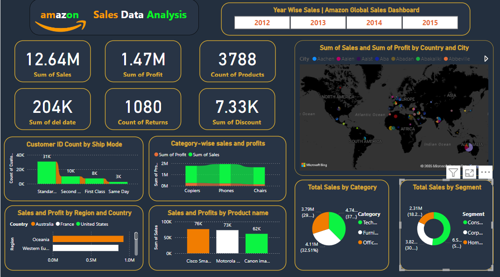

# Amazon Sales Data Analysis Dashboard

This repository contains an analysis of Amazon sales data, showcasing key metrics, trends, and visualizations from the dataset.

## Key Metrics

- **Total Sales:** $12.64M
- **Total Profit:** $1.47M
- **Delivery Date Sum:** 208K
- **Product Returns:** 1,080
- **Product Count:** 3,788
- **Total Discounts:** $7.33K

## Dashboard Features

### Customer Distribution
- Customer ID count by ship mode (Standard, Second Class, First Class, Same Day)

### Category Performance
- Sales and profits by product category (Copiers, Phones, Chairs)
- Total sales by category (Technology, Furniture, Office Supplies)

### Geographic Analysis
- Sales and profits by region and country (United States, France, Australia, etc.)
- City-level sales data (Ascher, Asler, Abe, etc.)

### Product Analysis
- Sales and profits by product name (Cisco, Motorola, Canon, etc.)

### Temporal Trends
- Year-wise sales from 2012 to 2015

### Segment Analysis
- Sales distribution by segment (Consumer, Corporate, Home)

## Data Sources
- Amazon sales data
- Microsoft Blog (referenced)

## How to Use
1. Clone this repository
2. Open the dashboard file (if included) or view the screenshot
3. Explore the various metrics and visualizations

## Screenshot

